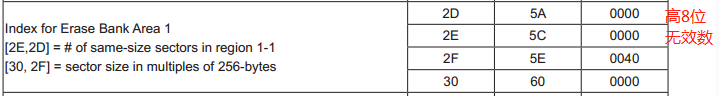

### 注意

NANDFlash NOR Flash  SDRAM  DM9000 共享数据线，需要有片选信号

 #### NOR/NAND Flash的差别

|                    | NOR                                       | NAND                                                         |
| ------------------ | ----------------------------------------- | ------------------------------------------------------------ |
| 容量               | 1~32MB                                    | 16~512MB                                                     |
| XIP     可执行程序 | Yes                                       | No                                                           |
| 擦除               | 非常慢(5s)                                | 快(3ms)                                                      |
| 写                 | 慢                                        | 快                                                           |
| 读                 | 快                                        | 快                                                           |
| 可靠性             | 比较高，位反转的比例小于NAND Flash 的10％ | 比较低：，位反转比较常见，必需有校验措施，比如“1-4 bit EDC/ECC”；必须有坏块管理措施 |
| 可擦除次数         | 10000~100000                              | 100000~1000000                                               |
| 生命周期           | 低于NAND Flash的10％                      | 是NOR Flash的10倍以上                                        |
| 接口               | 与**RAM**接口相同                         | I/O接口                                                      |
| 访问方法           | 随机访问                                  | 顺序访问                                                     |
| 易用性             | 容易                                      | 复杂                                                         |
| 主要用途           | 常用于保存代码和关键数据                  | 用于保存数据                                                 |
| 价格               | 高                                        | 低                                                           |

### NOR

#### Nor FLASH 基地址

片选是CS0，对应内存在bank0中

```
void nor_write_word(unsigned int base, unsigned int offset, unsigned int val)
{
	volatile unsigned short *p = (volatile unsigned short *)(base + (offset << 1));
	*p = val;
}

void nor_cmd(unsigned int offset, unsigned int cmd)
{
	nor_write_word(NOR_FLASH_BASE, offset, cmd);
}
```

#### NOR 一次读写两字节

 使用`volatile unsigned short *p`

```
unsigned int nor_read_word(unsigned int base, unsigned int offset)
{
	volatile unsigned short *p = (volatile unsigned short *)(base + (offset << 1));
	return *p;
}

unsigned int nor_dat(unsigned int offset)
{
	return nor_read_word(NOR_FLASH_BASE, offset);
}
```

#### NOR 名词解释

- erase block region : 里面含有1个或多个block, 它们的大小一样，一个nor flash含有1个或多个region， 一个region含有1个或多个block(扇区)

- Erase block region information: 前2字节+1    : 表示该region有多少个block , 后2字节*256  : 表示block的大小，这个需要查询cfi 对于具体的值的定义 refer to the CFI publication 100

  bits 31- 16 = z,  where the Erase Block(s) within this Region are (z) times 256 bytes

  bits 15 - 0 = y, where y+1 = Number of Erase Blocksof identical size within region

  假设一次能读取四字节，则是[31:0],但是实际我们读取的是2字节宽度，芯片手册读出来的是00加上一字节有效数据，我们使用取低字节则要移位拼接

  ```
  blocks = 1 + nor_dat(region_info_base) + (nor_dat(region_info_base+1)<<8);
  block_size = 256 * (nor_dat(region_info_base+2) + (nor_dat(region_info_base+3)<<8));
  ```

  

> 参考
>
> 标准：https://wenku.baidu.com/view/cd1c1e22482fb4daa58d4b42.html
>
>  中文：https://wenku.baidu.com/view/920905a63186bceb18e8bb38.html

#### 中断与NOR的影响

中断会打断指令，需要处理中断，否则: 测试nor时进入CFI等模式时, 如果发生了中断，cpu必定读NOR，那么读不到正确的指令，导致程序崩溃

#### 编译选项 -march=armv4

编译程序时加上: -march=armv4
否则 
volatile unsigned short *p = xxx;
*p = val; // 会被拆分成2个strb操作


### NAND

|        | NAND FLASH                                                   | S3C2440                           |
| ------ | ------------------------------------------------------------ | --------------------------------- |
| 发命令 | 选中芯片->CLE设为高电平 输出命令值->在DATA0~DATA7上->发出一个写脉冲 | NFCONT的bit1设为0,->NFCMMD=命令值 |
| 发地址 | 选中芯片->ALE设为高电平->在DATA0~DATA7上输出地址值->发出一个写脉冲 | NFCONT的bit1设为0,->NFADDR=地址值 |
| 发数据 | 选中芯片->ALE,CLE设为低电平-> 在DATA0~DATA7上输出数据值->发出一个写脉冲 | NFCONT的bit1设为0,->NFDATA=数据值 |
| 读数据 | 选中芯片->发出读脉冲->读DATA0~DATA7的数据                    | NFCONT的bit1设为0,->val=NFDATA    |

oob 用来处理位反转  out of  bank

注意： 使用nand 代码重定位的时候，注意make file 中的 链接文件 start ，nand 等文件放前面，保证在4k内