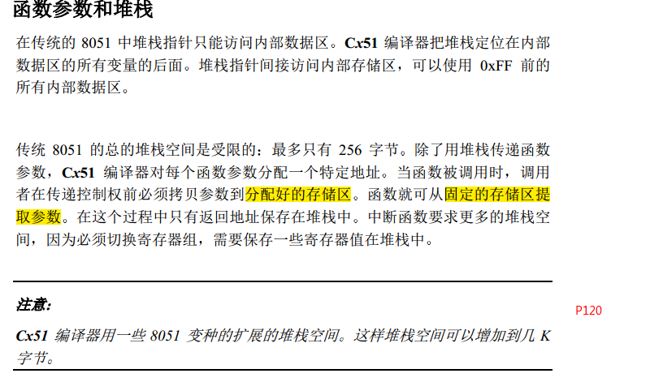
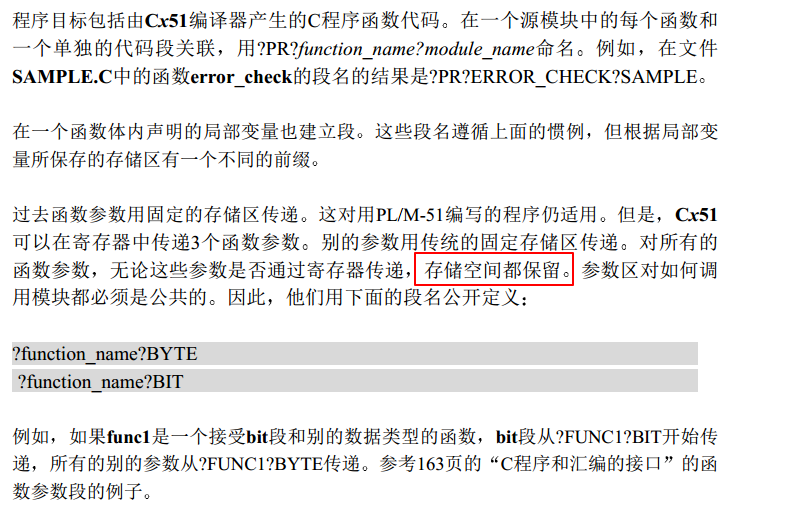
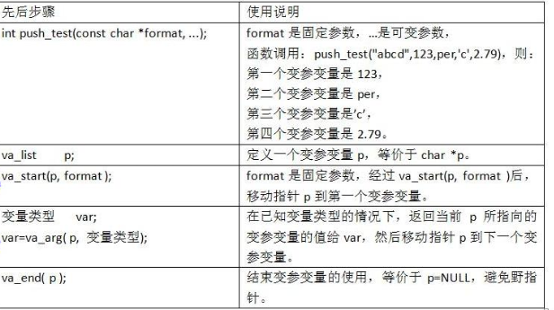

# Printf 不定参

#### 一些规定

- 不定参数的列表必须在整个函数的参数列表的最后
- 函数调用时参数传递是使用堆栈来实现的 
- 在51 和arm中，不论怎么传递参数，都确保是向下生长的栈（51是模拟的一个），第一个参数在**最低地址**即可，否则如果是向上生长的堆栈，取参数的宏就需要做改变了

#### ARM传递参数

- 当少于四个时，按从左到右的顺序依次放在r0,r1,r2,r3中;
- 当多于四个时，前四个放在r0,r1,r2,r3中，剩余的放在堆栈中，最后一个参数先入栈，第五个参数最后入栈，即从右到左入栈

例子如下：,传递参数先在r0,r1,r2,r3,然后放进栈中

```
    48:            testStack("1",(int)2,(int)3,(int)4,(int)5,(int)6,(int)7,(int)8,(int)9,(int)10,(int)11,(int)12,(int)13); 
0x0800028A 200D      MOVS     r0,#0x0D
0x0800028C 210C      MOVS     r1,#0x0C
0x0800028E 220B      MOVS     r2,#0x0B
0x08000290 230A      MOVS     r3,#0x0A
0x08000292 E9CD3205  STRD     r3,r2,[sp,#0x14]
0x08000296 E9CD1007  STRD     r1,r0,[sp,#0x1C]
0x0800029A 2009      MOVS     r0,#0x09
0x0800029C 2108      MOVS     r1,#0x08
0x0800029E 2207      MOVS     r2,#0x07
0x080002A0 2306      MOVS     r3,#0x06
0x080002A2 E9CD3201  STRD     r3,r2,[sp,#0x04]
0x080002A6 E9CD1003  STRD     r1,r0,[sp,#0x0C]
0x080002AA 2005      MOVS     r0,#0x05
0x080002AC 2304      MOVS     r3,#0x04
0x080002AE 2203      MOVS     r2,#0x03
0x080002B0 2102      MOVS     r1,#0x02
0x080002B2 9000      STR      r0,[sp,#0x00]
0x080002B4 A014      ADR      r0,{pc}+4  ; @0x08000308
0x080002B6 F7FFFFBD  BL.W     testStack (0x08000234)
```

使用时直接用堆栈，取出r0~~r3的值

```
    10: void testStack(char * format, ...) 
0x08000232 4770      BX       lr
    11: { 
0x08000234 B40F      PUSH     {r0-r3}
0x08000236 B570      PUSH     {r4-r6,lr}
    12:         char *p = (char * )&format; 
    13:         int i; 
    14:         int b; 
    15:  
    16:          
0x08000238 AC04      ADD      r4,sp,#0x10

.........................
```

当参数个数较少时， 可能也就单纯的赋值到r0~~r3

```
#include "stdio.h"

int  a1(int b)
{
  return (b)+1;
}


long  a[10];
void SystemInit(){;}
void testStack(int format, ...)
{
	char *p = (char * )&format;
	int i;
	int b;
	a[0]=format;
	a[1]=(long)&format;
	p = p + sizeof(int);

	b=(int)p;
	a1(b);
	
	i = *((int *)p);
	a[2]=*p;
	a[3]=(long)p;

a[4]=(long)p;			
}

int main()
{
	while(1)
	{
		testStack((int)1);
		testStack((int)1,(int)2);
		testStack((int)1,(int)2,(int)3);
		testStack((int)1,(int)2,(int)3,(int)4);
		testStack((int)1,0x11e23344,(int)0x11223f43,(int)0x11d23342,(int)0xa1223341);
	  testStack((int)1,(int)2,(int)3,(int)4,(int)5,(int)6,(int)7,(int)8,(int)9,(int)10,(int)11,(int)12,(int)13);
	}
}

```

实验结果，可以看出是sp里面的取值地址

```
a0=0x00000001
a1=0x200003F0
a2=0x00000002  其中有=44，因为第二个参数有不一样的
a3=0x200003F4
```


#### 51中参数传递

```
testStack("555555555",(int)2,(int)3,(int)4,(int)5,(int)6,(int)7,(int)8,(int)9,(int)10);

C:0x0F66    7BFF     MOV      R3,#0xFF
C:0x0F68    7A16     MOV      R2,#0x16
C:0x0F6A    7996     MOV      R1,#0x96
C:0x0F6C    752800   MOV      0x28,#0x00
C:0x0F6F    752902   MOV      0x29,#0x02
C:0x0F72    752A00   MOV      0x2A,#0x00
C:0x0F75    752B03   MOV      0x2B,#0x03
C:0x0F78    752C00   MOV      0x2C,#0x00
C:0x0F7B    752D04   MOV      0x2D,#0x04
C:0x0F7E    752E00   MOV      0x2E,#0x00
C:0x0F81    752F05   MOV      0x2F,#0x05
C:0x0F84    753000   MOV      0x30,#0x00
C:0x0F87    753106   MOV      0x31,#0x06
C:0x0F8A    753200   MOV      0x32,#0x00
C:0x0F8D    753307   MOV      0x33,#0x07
C:0x0F90    753400   MOV      0x34,#0x00
C:0x0F93    753508   MOV      0x35,#0x08
C:0x0F96    753600   MOV      0x36,#0x00
C:0x0F99    753709   MOV      0x37,#0x09
C:0x0F9C    753800   MOV      0x38,#0x00
C:0x0F9F    75390A   MOV      0x39,#0x0A
C:0x0FA2    121515   LCALL    testStack(C:1515)


void testStack(char * format, ...)
{
	char *p = (char * )&format;
	int i;
	int b;
	printf("arg1 : %s\n",format);
	printf("&arg1 : %p\n",&format);

	/*指针对连续空间操作时: 1) 取值  2)移动指针*/  
	p = p + sizeof(char *);
	b=(int)p;
	a1(b);
	i = *((int *)p);
	printf("arg2 : %d\n",i);
	printf("&arg2 : %p\n",p);   	
}

打印
arg1 : 1
&arg1 : i:0025
arg2 : 2
&arg2 : i:0028
```

函数调用的情况如下,可以看出先 `MOV R1,R2,R3 -->0x27,0x26,0x25`,之前`R1,R2,R3`正好是第一个参数的值，而之前其使用固定地址传值的地址正好是`0x28-->0x39`,其实后面再使用这个函数的时候，`0x28`总保持不变的，`0x39`根据可变参数个数来变，这就好办了，类似于知道**栈顶地址为0x28**，栈底我们可以根据不同方法来确认了（向下生长的栈）。

```
     9: void testStack(char * format, ...) 
C:0x0418    8B25     MOV      0x25,R3
C:0x041A    8A26     MOV      0x26,R2
C:0x041C    8927     MOV      0x27,R1
    10: { 
    11:         char *p = (char * )&format; 
    12:         int i; 
    13:         int b; 
    14:  
    15:          
C:0x041E    753700   MOV      0x37,#0x00
C:0x0421    753800   MOV      0x38,#0x00
C:0x0424    753925   MOV      0x39,#0x25
    16:         printf("arg1 : %s\n",format); 
C:0x0427    8B3D     MOV      0x3D,R3
C:0x0429    8A3E     MOV      0x3E,R2
C:0x042B    893F     MOV      0x3F,R1
C:0x042D    7BFF     MOV      R3,#0xFF
C:0x042F    7A04     MOV      R2,#0x04
C:0x0431    79E3     MOV      R1,#0xE3
C:0x0433    120065   LCALL    PRINTF(C:0065)

    17:         printf("&arg1 : %p\n",&format); 
    18:          
    19:          
    20:         /*指针对连续空间操作时: 1) 取值  2)移动指针*/   
C:0x0436    753D00   MOV      0x3D,#0x00
C:0x0439    753E00   MOV      0x3E,#0x00
C:0x043C    753F25   MOV      0x3F,#0x25
C:0x043F    7BFF     MOV      R3,#0xFF
C:0x0441    7A04     MOV      R2,#0x04
C:0x0443    79EE     MOV      R1,#0xEE
C:0x0445    120065   LCALL    PRINTF(C:0065)
    21:         p = p + sizeof(char *); 
    22:  
C:0x0448    7403     MOV      A,#0x03
C:0x044A    2539     ADD      A,0x39
C:0x044C    F539     MOV      0x39,A
C:0x044E    E4       CLR      A
C:0x044F    3538     ADDC     A,0x38
C:0x0451    F538     MOV      0x38,A
    23:         b=(int)p; 
C:0x0453    FE       MOV      R6,A
C:0x0454    AF39     MOV      R7,0x39
    24:         a1(b); 
    
        25:          
C:0x0456    12056F   LCALL    a1(C:056F)
    26:         i = *((int *)p); 
C:0x0459    AB37     MOV      R3,0x37
C:0x045B    AA38     MOV      R2,0x38
C:0x045D    A939     MOV      R1,0x39
C:0x045F    12035F   LCALL    C?ILDPTR(C:035F)
    27:         printf("arg2 : %d\n",i); 
C:0x0462    7BFF     MOV      R3,#0xFF
C:0x0464    7A04     MOV      R2,#0x04
C:0x0466    79FA     MOV      R1,#0xFA
C:0x0468    85F03D   MOV      0x3D,B(0xF0)
C:0x046B    F53E     MOV      0x3E,A
C:0x046D    120065   LCALL    PRINTF(C:0065)
    28:         printf("&arg2 : %p\n",p);        
    29:                  
    30:  
    31: } 
```

打印的结果如下,符合预期.R1,R2,R3 存储第一个参数的地址，后面的参数使用固定地址，最左边的参数所在地址越低，这就导致了和 使用向下生长的栈，且参数从右向左是一致的效果，然后在函数调用的时候讲R1，R2，R3的值再赋值给更低的固定地址。

```
arg1 : 1
&arg1 : i:0025
arg2 : 2
&arg2 : i:0028
```

main.c 如下，使用软件仿真即可

```
#include "stdio.h"
#include <reg51.h>

int  a1(int b)
{
  return (b)+1;
}

void testStack(char * format, ...)
{
	char *p = (char * )&format;
	int i;
	int b;
	printf("arg1 : %s\n",format);
	printf("&arg1 : %p\n",&format);
	/*指针对连续空间操作时: 1) 取值  2)移动指针*/  
	p = p + sizeof(char *);

	b=(int)p;
	a1(b);
	
	i = *((int *)p);
	printf("arg2 : %d\n",i);
	printf("&arg2 : %p\n",p);   			
}
void t()
{
	SCON= 0x50;/*SCON:工作模式1，8-bit UART，允许接收*/
	TMOD |= 0x20;/*TMOD：定时器T1，工作模式2, 8位自动重载方式*/
	TH1= 0xf3;/*当波特率为2400时，定时器初值*/
	TR1= 1;/*定时器T1开始运行*/
	TI= 1;/*允许发送数据*/
}
#include<intrins.h>       // 声明了void _nop_(void);
void main()
{
	_nop_();                         // 产生一条NOP指令
	_nop_();                         // 产生一条NOP指令
	_nop_();                         // 产生一条NOP指令
	_nop_();                         // 产生一条NOP指令
	_nop_();                         // 产生一条NOP指令
	_nop_();                         // 产生一条NOP指令
	_nop_();                         // 产生一条NOP指令
	t();
	{
		char * str="kakakq=%d,%d,%d,%d,%d,%d\r\n";
		printf(str,(int)1,(int)2,(int)3,(int)4,(int)5,(int)6);	
	}
	while(1)
	{
	   testStack("1",(int)2,(int)3,(int)4,(int)5);
	   	_nop_();                         // 产生一条NOP指令
	}
}
```





#### 如何确定不定参数个数 

- 在类型固定的参数中指明后面有多少个参数以及他们的类型。printf就是采用的这种方法，它的format参数指明后面每个参数的类型。 
- 指定一个结束参数。这种情况一般是不定参数拥有同样的类型，我们可以指定一个特定的值来表示参数列表结束。 

#### 构造printf引入

函数调用时参数传递是使用堆栈来实现的，参数入栈顺序是**从右向左**，在被调用函数 (Callee) 返回后，由调用方 (Caller)调整堆栈，由于这种约定，**C调用约定允许函数的参数的个数是不固定的**，这也是C语言的一大特色。因为每个调用的地方都需要生成一段清理堆栈的代码，所以最后生成的目标文件较`__stdcall、__fastcall`调用方式要大，因为每一个主调函数在每个调用的地方都需要生成一段清理堆栈的代码。C调用约定在返回前,要作一次堆栈平衡,也就是参数入栈了多少字节,就要弹出来多少字节.这样很安全.

**C程序栈底为高地址，栈顶为低地址，ARM栈一般为向下生长，C51为向上生长**,但是在参数传递的时候，没有使用这个栈，而是使用固定地址，他形成的也是一个向下生长的栈，具体看51中的参数传递

#### 使用不定参数

1. 获取定参地址，首地址
2. 对连续地址进行依次取值，移动指针到下一个参数的地址

#### 使用宏来操作不定参地址



> tips 之前一直在想如果是结构体一个成员传递是不是有对齐的问题。。。后来想起来这东西是值传递啊
>
> 但是在传递比如 char 这个类型的时候，为了保证4字节对齐，应将其改为int va_arg(int) 而不是va_arg(char)

```
typedef char *  va_list;
```

```
#define _INTSIZEOF(n)   ( (sizeof(n) + sizeof(int) - 1) & ~(sizeof(int) - 1) )// int 对齐
#define va_start(ap,v)  ( ap = (va_list)&v + _INTSIZEOF(v) ) //查询第一个参数的值，同时指针指向下一个
```

```
#define va_arg(ap,t)    (*(t *)(ap = ap + _INTSIZEOF(t), ap - _INTSIZEOF(t))) //取值，取值
逗号表达式返回后一个表达式的值
表达式1：ap = ap + _INTSIZEOF(t)
表达式2：*(t *)(ap + _INTSIZEOF(t)) //因为第一个表达式加了地址偏移了
```

```
#define va_end(ap)      ( ap = (va_list)0 )	
```

**注意：**

由于参数的地址用于va_start宏,所以参数不能声明为寄存器变量或数组类型，数组的话是地址进去了应该。

51的宏有所不同，具体去看STDARG.H

```
#define __STDARG_H__

#ifndef NULL
 #define NULL ((void *) 0)
#endif

#ifndef _VA_LIST_DEFINED
typedef char *va_list;
#define _VA_LIST_DEFINED
#endif

#define va_start(ap,v) ap = (va_list)&v + sizeof(v)
#define va_arg(ap,t) (((t *)ap)++[0])
#define va_end(ap)

#endif
```


#### 写程序

注意处理 类似 `%8d` 以%为标识符号 或者转义等先不处理

[源码参考](printf不定参.assets/自定义printf函数.rar)

### 备忘：

 printf 中 float 类型的数据默认按照double类型传递


