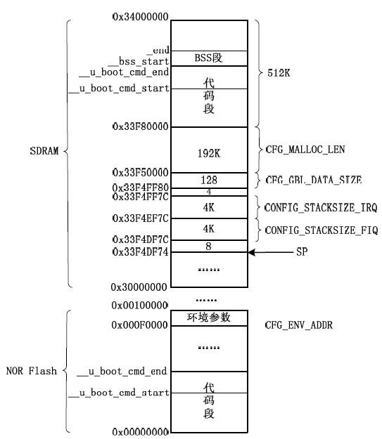
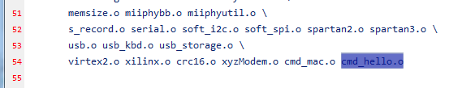
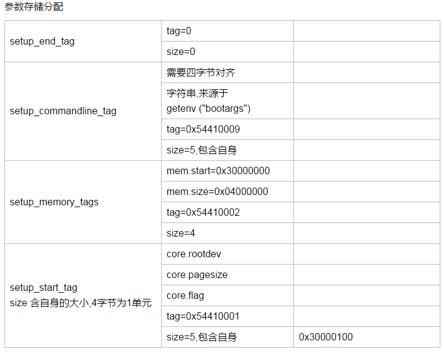

## 编译打补丁

1. 解压文件`tar xjf u-boot-1.1.6.tar.bz2 `
2. 复制补丁文件到文件夹`cp u-boot-1.1.6_jz2440.patch  u-boot-1.1.6`
3. 打补丁`patch -p1 < u-boot-1.1.6_jz2440.patch`
4. 配置并编译`make 100ask24x0_config`,`make`

### 补丁文件格式

例子：一个block

```
diff -urN u-boot-1.1.6/Makefile u-boot-1.1.6_jz2440/Makefile
--- u-boot-1.1.6/Makefile	2006-11-02 22:15:01.000000000 +0800
+++ u-boot-1.1.6_jz2440/Makefile	2010-11-26 12:54:37.830153999 +0800
@@ -206,8 +206,8 @@
 LIBS += drivers/libdrivers.a
 LIBS += drivers/nand/libnand.a
 LIBS += drivers/nand_legacy/libnand_legacy.a
+LIBS += drivers/usb/libusb.a
 LIBS += drivers/sk98lin/libsk98lin.a
-LIBS += post/libpost.a post/cpu/libcpu.a
 LIBS += common/libcommon.a
 LIBS += $(BOARDLIBS)
 
```

**路径**：这里第一行包含了补丁应用的位置`u-boot-1.1.6/Makefile u-boot-1.1.6_jz2440/Makefile`,在补丁命令中 `-px`中x表示忽略到第几层目录，因为我们把补丁文件已经copy到``u-boot-1.1.6`,所以需要忽略到第一层主目录。

**---**:表示原来的文件

**+++**:表示新的文件

`@@ -206,8 +206,8 @@`: @@是固定格式，-206表示原来的第206行，8表示总共8行，+206表示这是从新文件的206行，总共也有8行

下面的代码中，-表示删除这一行，+表示新增这一行，无`+-`表示保持原来的

### 浅析makefile 1

打开顶层目录下的MAKEFILE，查找 `100ask24x0_config`,在1886行

```
100ask24x0_config	:	unconfig
	@$(MKCONFIG) $(@:_config=) arm arm920t 100ask24x0 NULL s3c24x0
```

查找下变量 `MKCONFIG`

```
MKCONFIG	:= $(SRCTREE)/mkconfig
↓
SRCTREE		:= $(CURDIR)
```

继续百度下`$(CURDIR)`,发现CURDIR是make的内嵌变量，自动设置为当前目录 

编写一个makefile测试下,打印当前路径

```
all：
   @echo $(CURDIR)
```

测试结果如下

```
book@100ask:/work/test$ pwd
/work/test
book@100ask:/work/test$ ls
makefile
book@100ask:/work/test$ make
/work/test
book@100ask:/work/test$ cat makefile 
all:
	@echo $(CURDIR)
```

综上，所以一定有一个`mkconfig`在这个顶层目录,`ls mkconfig`有返回

```
@$(MKCONFIG) $(@:_config=) arm arm920t 100ask24x0 NULL s3c24x0
↓ @表示不回显，$表示取值
@mkconfig  $(@:_config=) arm arm920t 100ask24x0 NULL s3c24x0
↓ $(@:_config=)  中@表示目标，正常来说$@是目标，但是在$()里面@也表示目标，后面那个就是替换字符串为空
```

测试下`$(@:_config=)`

```
book@100ask:/work/test$ cat makefile 
hello_config: 
	@echo $(@:_config=)
	@echo $@
	@echo @
	@echo $(@)
	@echo $($@)
book@100ask:/work/test$ make
hello
hello_config
@
hello_config
          -------------最后一个输出是空
```

所以这个`@$(MKCONFIG) $(@:_config=) arm arm920t 100ask24x0 NULL s3c24x0`相当于

`@mkconfig 100ask24x0 arm arm920t 100ask24x0 NULL s3c24x0`也就是调用外部的shell脚本

#### 调用外部的命令

**注意**：关于调用外部的文件执行的时候要注意`chmod 777 外部文件名`

```
book@100ask:/work/test$ cat mkcfg 
echo i am in mkcfg ！
book@100ask:/work/test$ make
i am in mkcfg ！
------
/work/test/mkcfg
i am in mkcfg ！
------
/work/test/mkcfg
i am in mkcfg ！
------
book@100ask:/work/test$ cat makefile 
SRCTREE		:= $(CURDIR)
MKCONFIG	:= $(SRCTREE)/mkcfg

all:
	@$(MKCONFIG)
	@echo ------
	$(CURDIR)/mkcfg
	@echo ------
	/work/test/mkcfg
	@echo ------

```


### 解析mkconfig

```
@mkconfig 100ask24x0 arm arm920t 100ask24x0 NULL s3c24x0
```

[mkconfig.pdf](mkconfig解析.pdf)

[mkconfig.xls](mkconfig解析.xlsx)

书本P252有总结

总的来说，实现以下目标：

- 配置单板的名字
- 创建链接文件准备编译
- 创建`include\connfig.mk`,包含cpu，soc等信息
- 创建开发板相关头文件`config.h`
- `config.h`会去包含`单板名字.h` 这个文件来配置裁剪uboot，比如` #include <configs/100ask24x0.h>   `
  - 如果要在board目录下新建一个开发板<board_name>的目录，需要在include/config 下建立<board_name>.h
  - 功能开关选项
  - 参数设置，CFG_开头，比如缓冲区大小等

第002节_u-boot分析之Makefile结构分析 17：00

### 浅析makefile2--入口

可以看到一些文件包含，最主要的是先找到第一个目标 all，找到uboot 的可执行文件(elf)的生成

```
$(obj)u-boot:  depend version $(SUBDIRS) $(OBJS) $(LIBS) $(LDSCRIPT)
  UNDEF_SYM=`$(OBJDUMP) -x $(LIBS) |sed  -n -e 's/.*\(__u_boot_cmd_.*\)/-u\1/p'|sort|uniq`;\
  cd $(LNDIR) && $(LD) $(LDFLAGS) $$UNDEF_SYM $(__OBJS) \
   --start-group $(__LIBS) --end-group $(PLATFORM_LIBS) \
   -Map u-boot.map -o u-boot
```

通过直接查看make后生成的

```
cd /work/Test/uboot1.6/u-boot-1.1.6 && 

arm-linux-ld -Bstatic -T /work/Test/uboot1.6/u-boot-1.1.6/board/100ask24x0/u-boot.lds -Ttext 0x33F80000  $UNDEF_SYM cpu/arm920t/start.o \
                        --start-group lib_generic/libgeneric.a board/100ask24x0/lib100ask24x0.a cpu/arm920t/libarm920t.a cpu/arm920t/s3c24x0/libs3c24x0.a lib_arm/libarm.a fs/cramfs/libcramfs.a fs/fat/libfat.a fs/fdos/libfdos.a fs/jffs2/libjffs2.a fs/reiserfs/libreiserfs.a fs/ext2/libext2fs.a net/libnet.a disk/libdisk.a rtc/librtc.a dtt/libdtt.a drivers/libdrivers.a drivers/nand/libnand.a drivers/nand_legacy/libnand_legacy.a drivers/usb/libusb.a drivers/sk98lin/libsk98lin.a common/libcommon.a --end-group -L /work/tools/gcc-3.4.5-glibc-2.3.6/lib/gcc/arm-linux/3.4.5 -lgcc \
                        -Map u-boot.map -o u-boot
```

可以看到链接脚本`board/100ask24x0/u-boot.lds`和依赖的源文件,查看lds链接脚本，可以分析代码的组织和入口

代码是从`satrt.o`入手，链接在**0x33F80000**，小端模式链接，ENTRY(_start)

```
OUTPUT_FORMAT("elf32-littlearm", "elf32-littlearm", "elf32-littlearm")
/*OUTPUT_FORMAT("elf32-arm", "elf32-arm", "elf32-arm")*/
OUTPUT_ARCH(arm)
ENTRY(_start)
SECTIONS
{
	. = 0x00000000;

	. = ALIGN(4);
	.text      :
	{
	  cpu/arm920t/start.o	(.text)
          board/100ask24x0/boot_init.o (.text)
	  *(.text)
	}

	. = ALIGN(4);
	.rodata : { *(.rodata) }

	. = ALIGN(4);
	.data : { *(.data) }

	. = ALIGN(4);
	.got : { *(.got) }

	. = .;
	__u_boot_cmd_start = .;
	.u_boot_cmd : { *(.u_boot_cmd) }
	__u_boot_cmd_end = .;

	. = ALIGN(4);
	__bss_start = .;
	.bss : { *(.bss) }
	_end = .;
} 
```

搜索下33f800,`grep "33F80000" -nR` 注意大小写,

```
board/100ask24x0/config.mk:25:TEXT_BASE = 0x33F80000
```

这个参数是在`LDFLAGS`中定义的，搜索grep一下，有很多，在根目录下的`config.mk`有定义

```
config.mk:45:PLATFORM_LDFLAGS =
config.mk:189:LDFLAGS += -Bstatic -T $(LDSCRIPT) -Ttext $(TEXT_BASE) $(PLATFORM_LDFLAGS)
```

所以这个`33F80000`的链接地址是定义在TEXT_BASE中的

## 阶段1-start.s 分析

1. 设置为svc模式

2. 关开门狗

3. 屏蔽中断

4. 初始化（SDRAM）

5. 设置sp

6. 时钟

7. 重定位代码

8. bss段清零

9. 调用C函数 _start_armboot


```
#ifndef CONFIG_SKIP_LOWLEVEL_INIT
	adr	r0, _start		/* r0 <- current position of code   */
	ldr	r1, _TEXT_BASE		/* test if we run from flash or RAM */
	cmp     r0, r1                  /* don't reloc during debug         */
	blne	cpu_init_crit
#endif

//判断代码是从哪里开始运行的，adr	r0, _start	 取得当前代码的位置，如果当前是在nand启动的，那么这个地址就是0
//ldr	r1, _TEXT_BASE  取得链接地址
//如果是通过仿真器直接下载到sdram中运行的话，r0=链接地址=0x33f80000
//如果两个不想等，证明sdram还没初始化，要去初始化内存，初始化存储控制器
```

堆栈设置如下

| 0x33F80000              | uboot程序                       |
| ----------------------- | ------------------------------- |
| ·=-CFG_MALLOC_LEN       | malloc area                     |
| .=-CFG_GBL_DATA_SIZE    | bdinfo                          |
| .=-CONFIG_STACKSIZE_IRQ | IRQ 的栈                        |
| .=-CONFIG_STACKSIZE_FIQ | FRQ的栈                         |
| .=-12                   | leave 3 words for   abort-stack |
| sp的初始位置            |                                 |



## 阶段2 -C 文件功能处理

### 启动参数

- gd 指向128字节的内存
- 设置内核的启动参数位于0x30000100
- 环境变量存在flash上的

 **mainloop**

```
void start_armboot (void)
{
-----
	/* Pointer is writable since we allocated a register for it */
	gd = (gd_t*)(_armboot_start - CFG_MALLOC_LEN - sizeof(gd_t));    
-----    
    //函数指针,初始化设备
	for (init_fnc_ptr = init_sequence; *init_fnc_ptr; ++init_fnc_ptr) {
		if ((*init_fnc_ptr)() != 0) {
			hang ();
		}
	}
----  flash初始化,识别    
#ifndef CFG_NO_FLASH
	/* configure available FLASH banks */
	size = flash_init ();
	display_flash_config (size);
#endif /* CFG_NO_FLASH */    
------
    //分配堆
	/* armboot_start is defined in the board-specific linker script */
	mem_malloc_init (_armboot_start - CFG_MALLOC_LEN);
-----
    //uboot的环境变量
	/* initialize environment */
	env_relocate ();
-----
    //经过一系列的初始化
	/* main_loop() can return to retry autoboot, if so just run it again. */
	for (;;) {
		main_loop ();

}


init_fnc_t *init_sequence[] = {
	cpu_init,		/* basic cpu dependent setup */
	board_init,		/* basic board dependent setup */
	interrupt_init,		/* set up exceptions */
	env_init,		/* initialize environment */
	init_baudrate,		/* initialze baudrate settings */
	serial_init,		/* serial communications setup */
	console_init_f,		/* stage 1 init of console */
	display_banner,		/* say that we are here */
#if defined(CONFIG_DISPLAY_CPUINFO)
	print_cpuinfo,		/* display cpu info (and speed) */
#endif
#if defined(CONFIG_DISPLAY_BOARDINFO)
	checkboard,		/* display board info */
#endif
	dram_init,		/* configure available RAM banks */
	display_dram_config,
	NULL,
};

int board_init (void)
{
    ---
    /* support both of S3C2410 and S3C2440, by www.100ask.net */
    if (isS3C2410)
    {
        /* arch number of SMDK2410-Board */
        gd->bd->bi_arch_number = MACH_TYPE_SMDK2410;
    }
    else
    {
        /* arch number of SMDK2440-Board */
        gd->bd->bi_arch_number = MACH_TYPE_S3C2440;
    }

    /* adress of boot parameters */
    gd->bd->bi_boot_params = 0x30000100;

}
```

### 命令处理

增加一个hello的命令

####  命令的结构体：

至少有名字,最大的参数个数,是否可重复(按下回车是否再次执行),短的帮助信息,长的帮助信息(可选),用U_BOOT_CMD 实现

短的帮助信息演示： 直接输入 help

长的帮助信息 ： help xxx

```
struct cmd_tbl_s {
	char		*name;		/* Command Name			*/
	int		maxargs;	/* maximum number of arguments	*/
	int		repeatable;	/* autorepeat allowed?		*/
					/* Implementation function	*/
	int		(*cmd)(struct cmd_tbl_s *, int, int, char *[]);
	char		*usage;		/* Usage message	(short)	*/
#ifdef	CFG_LONGHELP
	char		*help;		/* Help  message	(long)	*/
#endif
#ifdef CONFIG_AUTO_COMPLETE
	/* do auto completion on the arguments */
	int		(*complete)(int argc, char *argv[], char last_char, int maxv, char *cmdv[]);
#endif
};
```

#### 命令参数,提取参数 

example： md.w 0 ------>argv[0]= "md.w", argv[1]=" 0"

```
/* Extract arguments */
if ((argc = parse_line (finaltoken, argv)) == 0) {
    rc = -1;	/* no command at all */
    continue;
}
```

#### 命令查找 

有两个关键参数__u_boot_cmd_start和__u_boot_cmd_end,是定义在链接脚本的

```
/* Look up command in command table */
if ((cmdtp = find_cmd(argv[0])) == NULL) {
    printf ("Unknown command '%s' - try 'help'\n", argv[0]);
    rc = -1;	/* give up after bad command */
    continue;
}

cmd_tbl_t *find_cmd (const char *cmd)
{
	cmd_tbl_t *cmdtp;
	cmd_tbl_t *cmdtp_temp = &__u_boot_cmd_start;	/*Init value */
	const char *p;
	int len;
	int n_found = 0;

	/*
	 * Some commands allow length modifiers (like "cp.b");
	 * compare command name only until first dot.
	 */
	len = ((p = strchr(cmd, '.')) == NULL) ? strlen (cmd) : (p - cmd);

	for (cmdtp = &__u_boot_cmd_start;
	     cmdtp != &__u_boot_cmd_end;
	     cmdtp++) {
		if (strncmp (cmd, cmdtp->name, len) == 0) {
			if (len == strlen (cmdtp->name))
				return cmdtp;	/* full match */

			cmdtp_temp = cmdtp;	/* abbreviated command ? */
			n_found++;
		}
	}
	if (n_found == 1) {			/* exactly one match */
		return cmdtp_temp;
	}

	return NULL;	/* not found or ambiguous command */
}
```

#### 段属性

定义了这个段u_boot_cmd 在command.h 

```
#define Struct_Section  __attribute__ ((unused,section (".u_boot_cmd")))
```

```
	. = .;
	__u_boot_cmd_start = .;
	.u_boot_cmd : { *(.u_boot_cmd) }
	__u_boot_cmd_end = .;
```

#### 命令的实现

命令结构体定义

```
#define Struct_Section  __attribute__ ((unused,section (".u_boot_cmd")))

#define U_BOOT_CMD(name,maxargs,rep,cmd,usage,help) \
cmd_tbl_t __u_boot_cmd_##name Struct_Section = {#name, maxargs, rep, cmd, usage, help}


---------------------------------------------------------------------------------
    举个例子 bootm 0x30007FC0
    U_BOOT_CMD 是用来定义命令结构体的
    展开是 ,强制定义了段属性
      __u_boot_cmd_bootm  __attribute__ ((unused,section (".u_boot_cmd"))) \
                 {“bootm”, CFG_MAXARGS, 1, do_bootm, 短的一个help, 长的一个help}
    
    ------------------------------------------------------------------------
 U_BOOT_CMD(
 	bootm,	CFG_MAXARGS,	1,	do_bootm,
 	"bootm   - boot application image from memory\n",//注意这个有逗号,下面的没有
 	"[addr [arg ...]]\n    - boot application image stored in memory\n"
 	"\tpassing arguments 'arg ...'; when booting a Linux kernel,\n"
 	"\t'arg' can be the address of an initrd image\n"
#ifdef CONFIG_OF_FLAT_TREE
	"\tWhen booting a Linux kernel which requires a flat device-tree\n"
	"\ta third argument is required which is the address of the of the\n"
	"\tdevice-tree blob. To boot that kernel without an initrd image,\n"
	"\tuse a '-' for the second argument. If you do not pass a third\n"
	"\ta bd_info struct will be passed instead\n"
#endif
);

```

#### 增加一个hello命令

参考cmd_bootm.c 的头文件,编写源代码cmd_hello.c

**一般一个xxx的命令,文件一般在cmd_xxx的c中,函数是do_xxx**

```
#include <common.h>
#include <watchdog.h>
#include <command.h>
#include <image.h>
#include <malloc.h>
#include <zlib.h>
#include <bzlib.h>
#include <environment.h>
#include <asm/byteorder.h>

int do_hello (cmd_tbl_t *cmdtp, int flag, int argc, char *argv[])
{
	int i ;
	printf ("hello world %d \n,", argc);
	//打印下参数
	for(i=0;i<argc;i++)
	{
		printf ("argv[%d] is %s \n",i,argv[i]);
	}
	return 0;
}

U_BOOT_CMD(
 	hello,	CFG_MAXARGS,	1,	do_hello,
 	"this is short help for hello  just test\n",
 	"this is long help for hello  just test\n"
);
```

修改common 的makefile 



测试

```
OpenJTAG> help
---
go      - start application at address 'addr'
hello  -this is short help for hello  just test
help    - print online help
icache  - enable or disable instruction cache

OpenJTAG> ? hello
hello hello  -this is long help for hello  just test

OpenJTAG> help hello
hello hello  -this is long help for hello  just test

OpenJTAG> hello
hello world 1
argv[0] is hello
OpenJTAG> hello 1 2 3 ceshi
hello world 5
argv[0] is hello
argv[1] is 1
argv[2] is 2
argv[3] is 3
argv[4] is ceshi
OpenJTAG>----------------这里就按了下回车,也就是参数的可重复的意思
hello world 5
argv[0] is hello
argv[1] is 1
argv[2] is 2
argv[3] is 3
argv[4] is ceshi
```

### 内核启动

#### 启动命令

uboot 运行内核分为两个步骤

1. `s=getenv ("bootcmd")` 获取环境变量
2. `run_command (s, 0);` 启动内核

uboot界面

1. `readline (CFG_PROMPT);` 读取输入
2. `run_command (s, ...);`

关键在于命令`bootcmd`

查看下环境变量 `print`

```
OpenJTAG> print
bootargs=noinitrd root=/dev/mtdblock3 init=/linuxrc console=ttySAC0
bootcmd=nand read.jffs2 0x30007FC0 kernel; bootm 0x30007FC0
baudrate=115200
ethaddr=08:00:3e:26:0a:5b
ipaddr=192.168.7.17
serverip=192.168.7.11
netmask=255.255.255.0
mtdids=nand0=nandflash0
mtdparts=mtdparts=nandflash0:256k@0(bootloader),128k(params),2m(kernel),-(root)
bootdelay=10
stdin=serial
stdout=serial
stderr=serial
partition=nand0,0
mtddevnum=0
mtddevname=bootloader

Environment size: 444/131068 bytes
```

可以看到内核的启动是

```
bootcmd=nand read.jffs2 0x30007FC0 kernel; bootm 0x30007FC0
```

从这个命令可以看出有两个步骤

1. 读取内核 `nand read.jffs2 0x30007FC0 kernel`, 从kernel分区读
2. 从xxx启动`bootm 0x30007FC0`

关于分区：PC机上有分区表，嵌入式中并没有，所谓的分区是在源码中写死的。这里是在100ask24x0.h中定义的

```
#define MTDIDS_DEFAULT "nand0=nandflash0"
#define MTDPARTS_DEFAULT "mtdparts=nandflash0:256k@0(bootloader)," \
                            "128k(params)," \
                            "2m(kernel)," \
                            "-(root)"
```

输入mtd查看分区地址,可以看到kernel从0x00060000起始

```
OpenJTAG> mtd

device nand0 <nandflash0>, # parts = 4
 #: name                        size            offset          mask_flags
 0: bootloader          0x00040000      0x00000000      0
 1: params              0x00020000      0x00040000      0
 2: kernel              0x00200000      0x00060000      0
 3: root                0x0fda0000      0x00260000      0

active partition: nand0,0 - (bootloader) 0x00040000 @ 0x00000000

defaults:
mtdids  : nand0=nandflash0
mtdparts: mtdparts=nandflash0:256k@0(bootloader),128k(params),2m(kernel),-(root)
```

所以命令就是 从nand的0x00060000读取0x00020000大小的数据 到 0x30007FC0

```
nand read.jffs2 0x30007FC0 kernel
nand read.jffs2 0x30007FC0 0x00060000   0x00020000
```

浅析：

- 一般对应bootcmd的命令的函数一般是do_bootcmd,所以 nand 会有函数do_nand
- 通过 ？nand 查看用法,看到 nand read[.jffs2]    - addr off|partition size

```
OpenJTAG> ? nand
nand info                  - show available NAND devices
nand device [dev]     - show or set current device
nand read[.jffs2]     - addr off|partition size
nand write[.jffs2]    - addr off|partiton size - read/write `size' bytes starting
    at offset `off' to/from memory address `addr'
nand read.yaffs addr off size - read the `size' byte yaffs image starting
    at offset `off' to memory address `addr'
nand write.yaffs addr off size - write the `size' byte yaffs image starting
    at offset `off' from memory address `addr'
nand read.raw addr off size - read the `size' bytes starting
    at offset `off' to memory address `addr', without oob and ecc
nand write.raw addr off size - write the `size' bytes starting
    at offset `off' from memory address `addr', without oob and ecc
nand erase [clean] [off size] - erase `size' bytes from
    offset `off' (entire device if not specified)
nand bad - show bad blocks
nand dump[.oob] off - dump page
nand scrub - really clean NAND erasing bad blocks (UNSAFE)
nand markbad off - mark bad block at offset (UNSAFE)
nand biterr off - make a bit error at offset (UNSAFE)
nand lock [tight] [status] - bring nand to lock state or display locked pages
nand unlock [offset] [size] - unlock section
```

- 为什么使用 jffs2

jffs2是一种文件格式，在这里并不需要文件格式，但是使用这个jffs2 可以不使用页对齐，如果使用nandread,需要考虑页对齐或者块对齐，最终会使用`nand_read_opts`

#### 内核复制移动

Flash上存储的内核格式为uImage，包含了一个头部加真正的内核

【头部结构】如下,其中ih_load表示加载地址,ih_ep表示入口地址,表示跳转的地址,bootm会先判断内核是否在加载地址,否则先移动内核到指定的加载地址,然后跳转。

```
/*
 * all data in network byte order (aka natural aka bigendian)
 */
#define IH_NMLEN		32	/* Image Name Length		*/

typedef struct image_header {
	uint32_t	ih_magic;	/* Image Header Magic Number	*/
	uint32_t	ih_hcrc;	/* Image Header CRC Checksum	*/
	uint32_t	ih_time;	/* Image Creation Timestamp	*/
	uint32_t	ih_size;	/* Image Data Size		*/
	uint32_t	ih_load;	/* Data	 Load  Address		*/
	uint32_t	ih_ep;		/* Entry Point Address		*/
	uint32_t	ih_dcrc;	/* Image Data CRC Checksum	*/
	uint8_t		ih_os;		/* Operating System		*/
	uint8_t		ih_arch;	/* CPU architecture		*/
	uint8_t		ih_type;	/* Image Type			*/
	uint8_t		ih_comp;	/* Compression Type		*/
	uint8_t		ih_name[IH_NMLEN];	/* Image Name		*/
} image_header_t;
```

```
bootcmd=nand read.jffs2 0x30007FC0 kernel; bootm 0x30007FC0
```

命令中0x30007FC0 地址可以随便放，只要不破坏已经用到的信息就好，然后在uImage中有入口地址和加载地址。 `bootm`命令会先去读取加载地址和运行地址，如果发现当前内核并不在加载地址，需要移动内核到加载地址。可以去看下`do_bootm`函数中`memmove ((void *) ntohl(hdr->ih_load), (uchar *)data, len);` 移动内核。jz2440 的加载地址是0x30008000,读取到0x30007FC0,0x30008000-0x30007FC0=64字节,因为头部结构体=64字节,刚好不用移动内核。

#### uboot 传递参数给内核

**在某个地址按某种格式存储参数**，这个格式称为tag，--0x30000100 存储

处理完内核文件后，启动内核函数`    do_bootm_linux  (cmdtp, flag, argc, argv,addr, len_ptr, verify);`会继续调用`theKernel (0, bd->bi_arch_number, bd->bi_boot_params);`

```
void do_bootm_linux (cmd_tbl_t *cmdtp, int flag, int argc, char *argv[],
		     ulong addr, ulong *len_ptr, int verify)
    //设置参数
    setup_start_tag (bd);
    setup_memory_tags (bd);
    setup_commandline_tag (bd, commandline);
    setup_end_tag (bd);
    
    //theKernel 的入口地址是uimage的头部的入口地址
    theKernel = (void (*)(int, int, uint))ntohl(hdr->ih_ep);
    //启动内核
    theKernel (0, bd->bi_arch_number, bd->bi_boot_params);
```

tag格式如下

```
struct tag {
	struct tag_header hdr;
	union {
		struct tag_core		core;
		struct tag_mem32	mem;
		struct tag_videotext	videotext;
		struct tag_ramdisk	ramdisk;
		struct tag_initrd	initrd;
		struct tag_serialnr	serialnr;
		struct tag_revision	revision;
		struct tag_videolfb	videolfb;
		struct tag_cmdline	cmdline;

		/*
		 * Acorn specific
		 */
		struct tag_acorn	acorn;

		/*
		 * DC21285 specific
		 */
		struct tag_memclk	memclk;
	} u;
};

#define tag_next(t)	((struct tag *)((u32 *)(t) + (t)->hdr.size))
#define tag_size(type)	((sizeof(struct tag_header) + sizeof(struct type)) >> 2)
```

先设置一个起始的标记,标记了起始地址是0x30000100

```
static void setup_start_tag (bd_t *bd)
{
	params = (struct tag *) bd->bi_boot_params;//参数的起始地址

	params->hdr.tag = ATAG_CORE;
	params->hdr.size = tag_size (tag_core);

	params->u.core.flags = 0;
	params->u.core.pagesize = 0;
	params->u.core.rootdev = 0;

	params = tag_next (params);
}

int board_init (void)
{
    ...
    gd->bd->bi_boot_params = 0x30000100;
}
```

然后设置内存的空间起始0x30000000和大小64M,并没有动态检测,是个固定值

```
static void setup_memory_tags (bd_t *bd)
{
	int i;

	for (i = 0; i < CONFIG_NR_DRAM_BANKS; i++) {
		params->hdr.tag = ATAG_MEM;
		params->hdr.size = tag_size (tag_mem32);

		params->u.mem.start = bd->bi_dram[i].start;
		params->u.mem.size = bd->bi_dram[i].size;

		params = tag_next (params);
	}
}


/*-----------------------------------------------------------------------
 * Physical Memory Map
 */
#define CONFIG_NR_DRAM_BANKS	1	   /* we have 1 bank of DRAM */
#define PHYS_SDRAM_1		0x30000000 /* SDRAM Bank #1 */
#define PHYS_SDRAM_1_SIZE	0x04000000 /* 64 MB */

#define PHYS_FLASH_1		0x00000000 /* Flash Bank #1 */

#define CFG_FLASH_BASE		PHYS_FLASH_1
#define CFG_MONITOR_BASE	PHYS_FLASH_1
int dram_init (void)
{
    gd->bd->bi_dram[0].start = PHYS_SDRAM_1;
    gd->bd->bi_dram[0].size = PHYS_SDRAM_1_SIZE;

    return 0;
}
```

设置命令tag,多了参数commandline,源自环境变量bootargs

```
bootargs=noinitrd root=/dev/mtdblock3 init=/linuxrc console=ttySAC0
                  #根目录是flash下的第四个分区,第一个应用程序是linuxrc,打印信息的设备是串口0
```

```
char *commandline = getenv ("bootargs");
setup_commandline_tag (bd, commandline);
```

设置结束tag

```
static void setup_end_tag (bd_t *bd)
{
	params->hdr.tag = ATAG_NONE;
	params->hdr.size = 0;
}
```



#### 机器ID识别启动

`theKernel (0, bd->bi_arch_number, bd->bi_boot_params)`最终启动内核。`bd->bi_boot_params`表示参数，

`bd->bi_arch_number`表示机器ID。

```
int board_init (void)
{
    gd->bd->bi_arch_number = MACH_TYPE_S3C2440;
}
```

使用boot命令直接调用即可启动。


 

## 常用linux命令

打包 tar cjvf 压缩文件名 目录名 


## Makefile 常用的查询

@echo 表示不回显命令 没有@表示回显命令

$(CURDIR) 表示当前路径, 

$表示取值 

如果调用外部的文件命令，一定要检查权限，也就是可以`chmod 777 configfile`


## shell 基本命令

$# 表示参数的个数
-gt 大于
$1 传给shell的第一个参数
shift 位置参数左移
esac  case 结束
${1%%_config} 将第一个参数的_config删除，参考advanced_bash p120