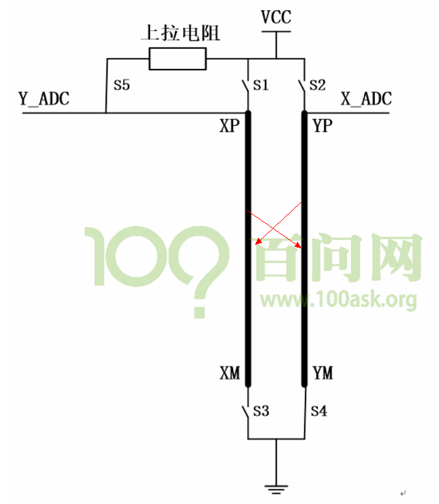
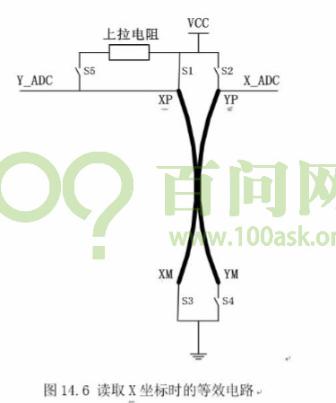
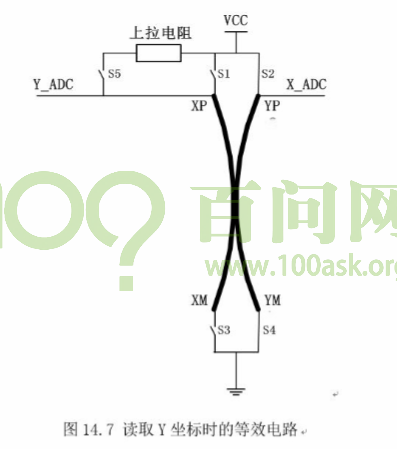
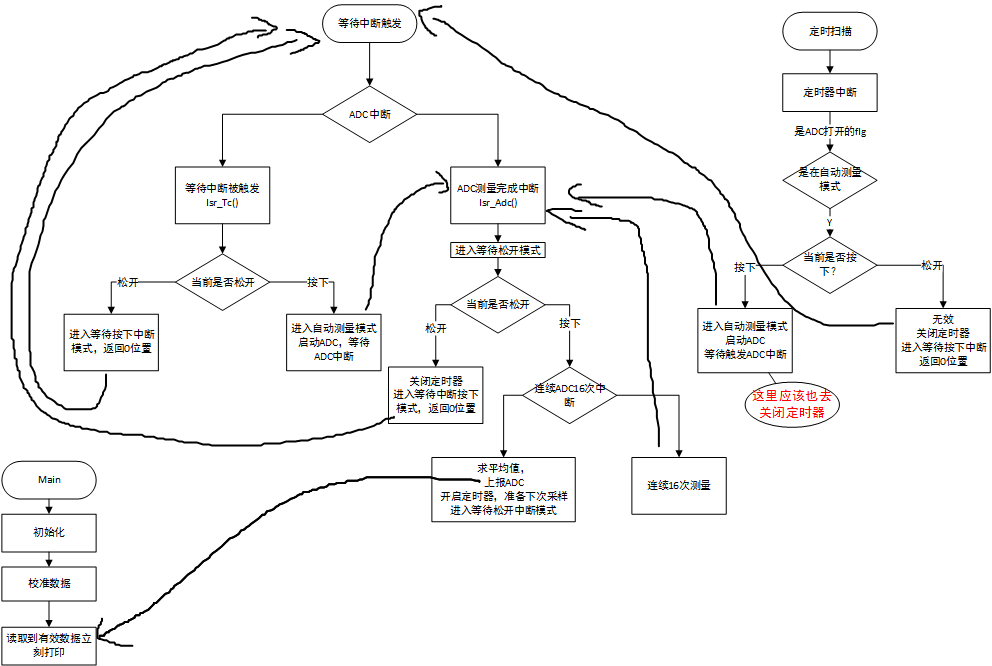
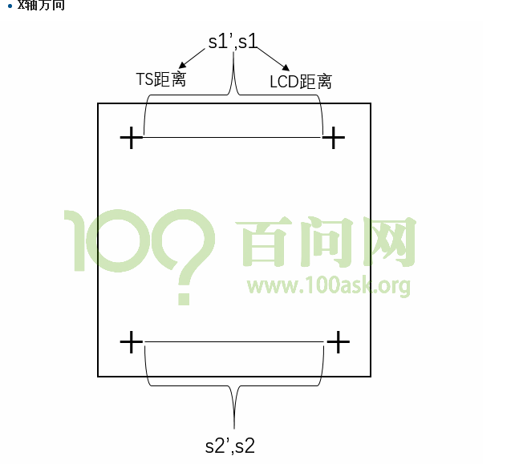

## ADC引入

s3C2440有8路ADC，两路为触摸屏的X轴Y轴，触摸屏采样有3种方式：

- 自动反转XY轴相关开关采样

- 手动切换开关采样

- 等待中断模式，这个是平时没按下的状态

  ​


### 触摸屏的等效电路




### 逻辑测量步骤
触摸屏实际有两层，按下的时候，导通了上下两个平面，通过等效电路，可以看出通过切换开关，能够得到两种阻值。
1. 按下触摸屏 按下触摸屏时，对于一个高效的系统，产生中断，这是触摸屏中断

2. 在触摸中断程序中 启动ADC，(获得数据，xy坐标)启动ADC就开始模数转换，不可能瞬间完成

3. ADC完成， 产生中断

4. ADC中断中读取x y坐标，我们来想想，在这个流程里，启动触摸屏的源头是按下触摸屏，那如果长按触摸屏，我按下之后一直不松开 滑动手指呢那么谁来触发后续的多次ADC转换呢 不可能只启动一次吧, 为了支持 长按 滑动操作，我们需要启用定时器.

5. 启动定时器

6. 定时器中断发生，判断触摸屏是否仍被按下，如果按下就循环上述过程
   - 在触摸中断程序中 启动ADC，(获得数据，xy坐标)启动ADC就开始模数转换，不可能瞬间完成
   - ADC完成， 产生中断
   - ADC中断中读取x y
   - 松开结束一个流程

   等效电路反转如下

   







简单步骤：这里有两个模式：A.等待（按下/松开）中断  B自动XY测量

1. 检测到触摸屏第一次按下，来触发接下去的动作
2. 不断去扫描ADC，获取X，Y的坐标，这里用定时器去触发
3. 有中断触发告知松开按键

程序流程

[流程图](触摸屏.assets/触摸屏流程.vsdx)





### LCD 校准定位

其实就是  ( ( s1’ /s1)+ (  s3’ )/s1)/2  两个斜率取平均

KX = ( s1’ + s3’ )/2/s1 、KY = ( s2’ + s4’ )/2/s2   

https://blog.csdn.net/yangseng1987/article/details/20780379



a. 对于触摸屏要多次测量求平均值
b. 要丢弃非法值(以LCD分辨率作为判断准备)
c. 较准时一定要点准

下载参考tslib库，tslib还有其他功能，比如判断连续点之间的距离，如果过大就丢弃。
这可以解决我们程序中出现的问题：画线时突然有某个点在很远的距离出现

### 注意：

代码重定位的定时器优化  修改 makefile

```
修改Makefile 我们把 start.o init.o nand_flash.o放在最前面
```


